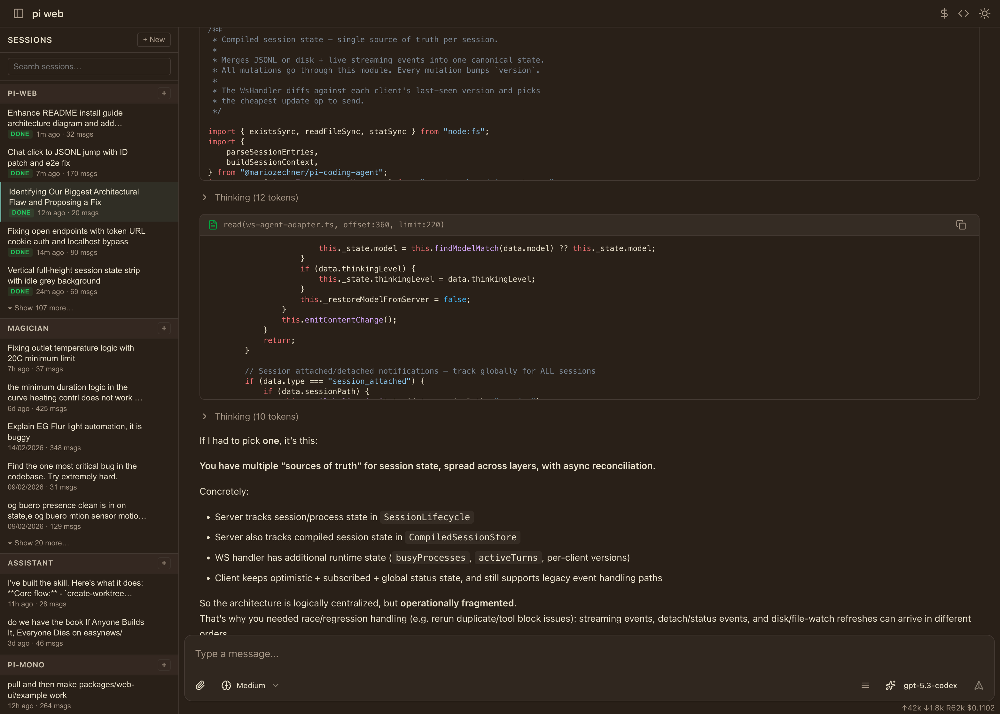
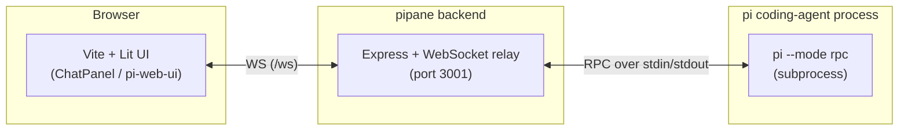

# pipane

A clean web interface for the **pi coding agent**.

`pipane` runs a local backend that launches `pi` in RPC mode and streams agent messages to a browser UI over WebSocket.

## Screenshot



---

## What you get

- Chat-style UI for `pi`
- Real-time tool calls and streaming output
- Session picker and model picker
- Automatic `pi` install prompt if the CLI is missing

---

## Install from GitHub (recommended)

### 1) Clone the repo

```bash
git clone https://github.com/mike-heunher/pipane.git
cd pipane
```

### 2) Install dependencies

```bash
npm install
```

### 3) Start in development mode

```bash
npm run dev
```

Then open:
- Frontend: http://localhost:5173
- Backend API/WS: http://localhost:3001

> In dev mode, Vite proxies `/ws` to the backend automatically.

---

## Run in production locally

```bash
npm run build
npm run start
```

Open http://localhost:3001.

---

## Install as a global CLI

If you want to run `pipane` directly as a command:

```bash
npm install -g pipane
pipane
```

---

## Requirements

- Node.js 20+
- npm 10+
- `pi` CLI available on your `PATH` (default)

If `pi` is missing, `pipane` can prompt to install it via:

```bash
npm install -g @mariozechner/pi-coding-agent
```

---

## Configuration

Environment variables:

- `PI_CWD` — Working directory for the agent (default: current directory)
- `PI_CLI` — Override the CLI executable/path (default: `pi`)
- `PORT` — Backend port (default: `3001`)

LLM/API keys are read from standard environment variables (for example `ANTHROPIC_API_KEY`, etc.).

Local user settings (macOS + Linux):

- Path: `~/.piweb/settings.json`
- Read on server startup; invalid config falls back to defaults
- Save API auto-formats JSON with stable indentation

Current schema:

```json
{
  "version": 1,
  "sidebar": {
    "cwdTitle": {
      "filters": [
        { "pattern": "^~/dev/", "replacement": "dev/" }
      ]
    }
  }
}
```

Sidebar cwd title behavior:

1. Start from full cwd path
2. Replace `$HOME` prefix with `~`
3. Apply `sidebar.cwdTitle.filters` in order (regex `pattern` + `replacement`)

REST endpoints:

- `GET /api/settings/local` — read effective settings + path + diagnostics
- `POST /api/settings/local/validate` with `{ "content": "...json..." }`
- `PUT /api/settings/local` with `{ "content": "...json..." }` (validate + auto-format + save)

---

## Load tracing (frontend + backend)

`pipane` now emits a correlated load trace across browser and server.

- Frontend creates a `traceId` when the app boots.
- The `traceId` is sent via:
  - WebSocket query param (`/ws?traceId=...`)
  - HTTP header (`x-pi-trace-id`) for REST calls
  - frontend trace event endpoint (`POST /api/debug/load-trace/event`)
- Backend records HTTP/WS spans and keeps traces in memory.

Debug endpoints:

- `GET /api/debug/load-trace/latest` — latest traces
- `GET /api/debug/load-trace/:traceId` — one trace

## Architecture



---

## Development

```bash
npm run dev
```

Starts both:
- Backend server on `:3001`
- Vite frontend on `:5173`

Session listing/jsonl parsing benchmark:

```bash
npm run bench:sessions -- --sessions 250 --messages 120 --iterations 15
```

---

## Testing

Run all tests:

```bash
npm run test && npx playwright test --timeout 60000
```

---

## License

[MIT](LICENSE)
