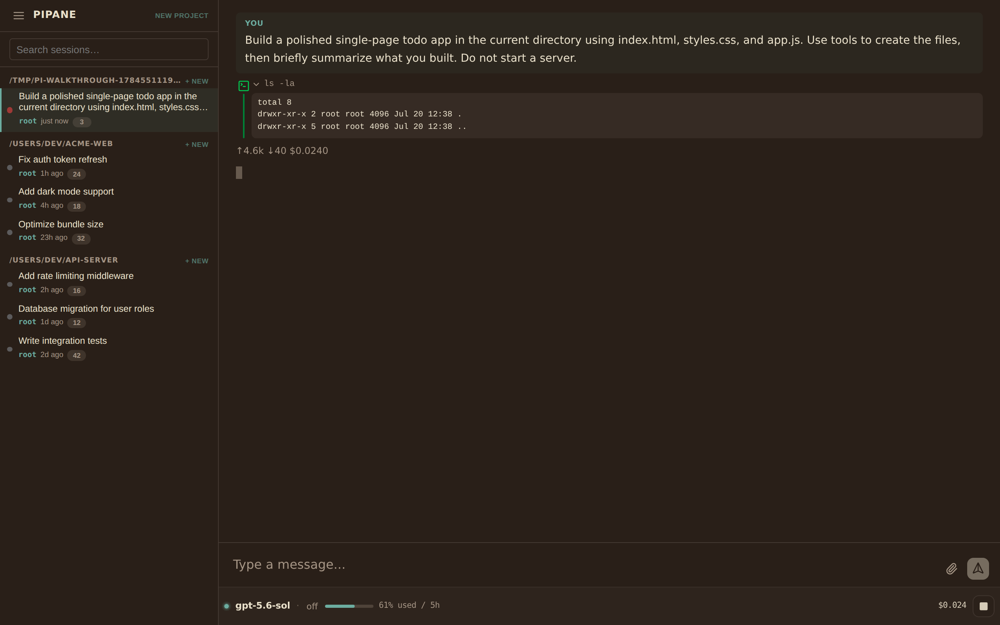

# pipane

A clean web interface for the **pi coding agent**. Open any pi conversation in pipane, open any pipane conversation in pi -- full interop.

`pipane` runs a local backend that launches `pi` in RPC mode and streams agent messages to a browser UI over WebSocket.

## Walkthrough

Hero shot:



Walkthrough (GIF):


---

## Quickstarts

Requires Node.js 22.19 or newer, matching the bundled Pi runtime and extension APIs.

```bash
npm install -g pipane
```

If `pi` is missing, install it like this:

```bash
npm install -g @earendil-works/pi-coding-agent
```

Run `pipane` to start the backend. It registers with `https://pipane.dev` by default and uses the machine's short hostname as its backend name, so no remote-access environment variables are required. Set `PIPANE_BACKEND_NAME` to customize the name, `PIPANE_RENDEZVOUS_URL` to use another rendezvous service, or set `PIPANE_RENDEZVOUS_URL` to an empty value to disable remote registration.

### Explicit local deployments

Deploy the current working tree to the separate dev instance with:

```bash
npm run deploy:dev
```

This builds a release, atomically advances the `pipane-dev` systemd service, and verifies it on port `8223`. It does not change production.

Deploy the current committed working tree to local production with:

```bash
npm run deploy:prod
```

Production deployment requires a clean Git working tree, atomically advances the `pipane` systemd service, verifies it on port `8222`, and rolls back if the health check fails. Both commands skip dependency installation when `package-lock.json` is unchanged and retain five releases.

```bash
journalctl -u pipane-dev -f
journalctl -u pipane -f
```

---

## What you get

- Session list and clean UI for `pi`
- Real-time tool calls and streaming output, nicely crafted
- A nice session picker
- ChatGPT/Codex and Claude subscription usage in the input toolbar
- A large amount high quality "vibe-code".

Provider usage is supplied by the bundled `@sreetej510/pi-usage` Pi extension and uses Pi's existing authentication. Set `PIPANE_USAGE_EXTENSION=0` when starting pipane to disable it.

---

## Browser UI ownership

The renderer tree under [`src/client/ui/`](src/client/ui/) is maintained directly by pipane. It is derived from the final pi-mono `web-ui` release (`v0.75.3`) with pipane's flat message renderer, steering editor, thinking display, attachment handling, and tool renderers integrated into one local path. Pipane does not patch or load an external `pi-web-ui` package. See [`UPSTREAM.md`](src/client/ui/UPSTREAM.md) and [`THIRD_PARTY_NOTICES.md`](THIRD_PARTY_NOTICES.md).

The versioned browser WebSocket contract and validated Pi subprocess boundary are documented in [`docs/protocol.md`](docs/protocol.md).

## Testing

Run the complete local verification gate with:

```bash
npm run test:all
```

This typechecks the repository, runs Vitest with coverage thresholds, builds the production client/server, and runs the deterministic Playwright suite. The real-credential walkthrough is separate: `npm run test:walkthrough`.

## License

[MIT](LICENSE)
